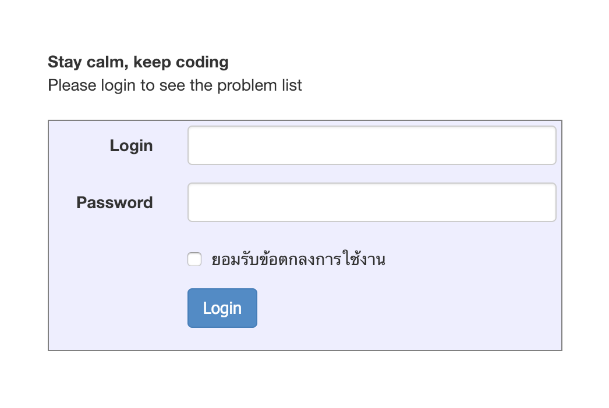

# Notice

Sample solutions for CU 2110327 Algorithm Design course (Academic year 2018).
You may ask [me](https://www.facebook.com/natchapolsrisang) any questions you have or report bugs if any.



_site: [nattee.net/grader](https://nattee.net/grader)_

# Contribution

For those who want to contribute to this repository, please add author's name in the header as following:

## C++

```cpp
/*
 * AUTHOR: (Author's name)
 * KEYWORD: (Keywords related to the problem, if any)
 */
```

## Python

```py
#
# AUTHOR: (Author's name)
# KEYWORD: (Keywords related to the problem, if any)
#
```

### For other languages, please also follow the patterns.

Finally, thank you for your contribution.

# Remark

### Please do not copy the codes. You should take these as the examples and write your own codes.

Blogs for algorithm coming soon...
